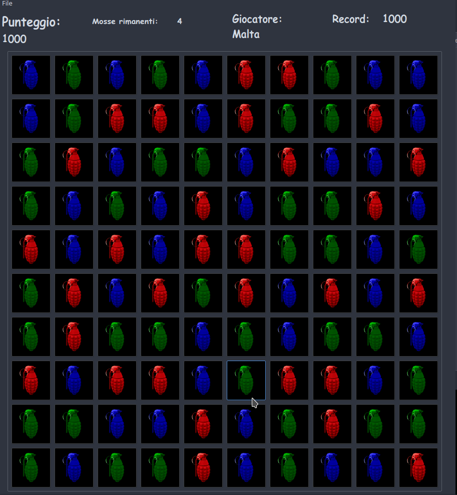

# Candy Crush Malta
I made this game as University project during my bachelor at Politecnico di Milano, Italy, in AA 2014/2015 for the course "Fondamenti di Informatica" (Fundaments of Informatics). 

Made with Qt Creator and QtGui libraries.

This is the first programming course I have taken in my life, so this program may have lots of bad practices and bugs :)

## Instructions

Requires QtGui libraries.

Run `qmake` and then `make`

Run the executable: `./CandyCrushGui`

You can also import the project into QtCreator and build from there.

Enjoy!
